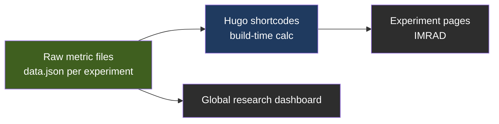

# Academic Research Dashboard Design

**Owner:** Garrett Manley · **Date:** 2026-03-30 · **Status:** Draft (historical) · **Tracker:** hb-doc.2 · **Trace ID:** trace-20260330-001

This design transforms the Hugo-based lab site (`site/`) into a formal computer-science research portal, replacing sparse summaries with rigorous, data-driven academic documentation for every workspace experiment.

## Scope

- **In scope:** experiment content under `site/content/docs/experiments/`, the experiment data layer, and the aggregated research dashboard.
- **Out of scope:** corporate and external repositories; non-experiment site pages.

## System overview

Experiments move to a structured data layer with build-time metric calculation, surfaced through Hugo shortcodes and a global dashboard.

## Design details

### Academic content structure (IMRAD)

Each experiment Markdown file under `site/content/docs/experiments/` follows a formal structure:

- **Abstract:** 150 to 250 words covering problem, intervention, and results.
- **Introduction:** defines the agentic gap and the hypothesis.
- **Methodology:** models, temperature, sample size, and prompts.
- **Results:** quantitative analysis with high-density metrics (CPS, Pass^k, efficiency).
- **Discussion and limitations:** why results occurred and what biases apply.
- **Reproducibility:** machine-readable trace IDs and verification commands.

### Experiment data layer

- **Per-experiment folder:** each experiment owns a directory with a `data.json` or `metrics.yaml` file (for example `site/content/docs/experiments/001/data.json`).
- **Raw metric storage:** data files store raw counts (successes, trials, tokens), not pre-computed percentages.
- **Hugo shortcodes:** shortcodes such as `` compute Pass^k, CPS, and tokens-per-success at build time.
- **Visualization:** SVG or Chart.js rendering for confidence intervals and performance trends.

### Dashboard and layout

- **Global research dashboard:** a single page aggregating every experiment scorecard from the data files.
- **Layout toggles:** switch between an executive view (high level) and a research view (full academic rigor).
- **Workspace pulse chart:** a homepage trendline showing CPS falling and Pass^k rising over time.
- **Callout components:** UI blocks for hypotheses, observations, and data tables.

### Success criteria

- Zero "informationally sparse" descriptions in validated experiments.
- All primary metrics computed at build time (no manual math in Markdown).
- Automated aggregation into the global dashboard.
- Verified rendering of data visualizations in the published HTML.

### Implementation stages

1. **Core templates:** create the IMRAD archetypes and shortcodes.
2. **Data migration:** move metrics from experiments 001 to 005 into `data.json` files.
3. **Dashboard build:** implement aggregation logic and layout toggles.
4. **Visual polish:** finalize the scientific aesthetic.

## Dependencies

- Hugo with the Hextra theme.
- Experiment data files (`data.json` / `metrics.yaml`) and custom shortcodes.

## References

- `docs/superpowers/specs/2026-03-30-content-gap-report.md`.

## Revision history

| Date | Change |
| :--- | :--- |
| 2026-03-30 | Original draft. |
| 2026-06-01 | Standardized header and section order; added system-overview diagram; marked historical. |
